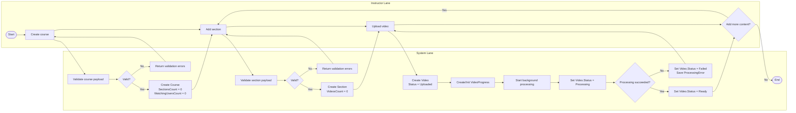

# Teachio Course Publishing Process Diagram (BPMN-style)

```mermaid
flowchart LR
  %% BPMN-style process aligned with current EF Core entities

  subgraph L1[Instructor Lane]
    I1([Start]) --> I2[Create course]
    I2 --> I3[Add section]
    I3 --> I4[Upload video]
    I4 --> I5{Add more content?}
    I5 -- Yes --> I3
  end

  subgraph L2[System Lane]
    S1[Validate course payload]
    S2{Valid?}
    S3[Return validation errors]
    S4[Create Course\nSectionsCount = 0\nWatchingUsersCount = 0]

    S5[Validate section payload]
    S6{Valid?}
    S7[Return validation errors]
    S8[Create Section\nVideosCount = 0]

    S9[Create Video\nStatus = Uploaded]
    S10[Create/Init VideoProgress]
    S11[Start background processing]
    S12[Set Video.Status = Processing]
    S13{Processing succeeded?}
    S14[Set Video.Status = Failed\nSave ProcessingError]
    S15[Set Video.Status = Ready]
    S16([End])
  end

  I2 --> S1
  S1 --> S2
  S2 -- No --> S3
  S3 --> I2
  S2 -- Yes --> S4
  S4 --> I3

  I3 --> S5
  S5 --> S6
  S6 -- No --> S7
  S7 --> I3
  S6 -- Yes --> S8
  S8 --> I4

  I4 --> S9
  S9 --> S10
  S10 --> S11
  S11 --> S12
  S12 --> S13

  S13 -- No --> S14
  S14 --> I4

  S13 -- Yes --> S15
  S15 --> I5
  I5 -- No --> S16
```
