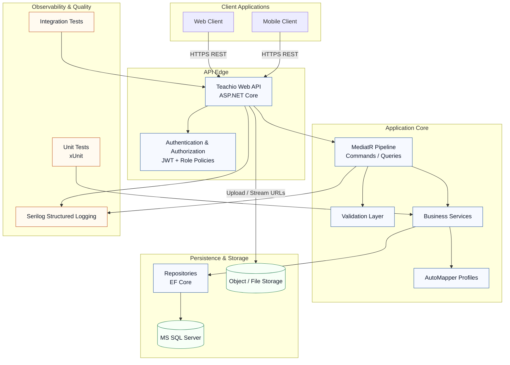

# Teachio Backend Component Diagram

```mermaid
flowchart TB
  %% Teachio backend component architecture (v2)

  subgraph Clients[Client Applications]
    Web[Web Client]
    Mobile[Mobile Client]
  end

  subgraph Edge[API Edge]
    Api[Teachio Web API\nASP.NET Core]
    Auth[Authentication & Authorization\nJWT + Role Policies]
  end

  subgraph AppCore[Application Core]
    Med[MediatR Pipeline\nCommands / Queries]
    Val[Validation Layer]
    Biz[Business Services]
    Map[AutoMapper Profiles]
  end

  subgraph Data[Persistence & Storage]
    Repo[Repositories\nEF Core]
    Sql[(MS SQL Server)]
    Video[(Object / File Storage)]
  end

  subgraph Quality[Observability & Quality]
    Log[Serilog Structured Logging]
    Unit[Unit Tests\nxUnit]
    Int[Integration Tests]
  end

  Web -->|HTTPS REST| Api
  Mobile -->|HTTPS REST| Api

  Api --> Auth
  Api --> Med
  Med --> Val
  Med --> Biz
  Biz --> Map
  Biz --> Repo

  Repo --> Sql
  Api -->|Upload / Stream URLs| Video

  Api --> Log
  Med --> Log

  Unit --> Biz
  Int --> Api

  classDef layer fill:#f6f9ff,stroke:#2f5d9f,stroke-width:1px,color:#0f172a;
  classDef store fill:#f7fff7,stroke:#2f855a,stroke-width:1px,color:#111827;
  classDef quality fill:#fffaf0,stroke:#c05621,stroke-width:1px,color:#111827;

  class Api,Auth,Med,Val,Biz,Map,Repo layer;
  class Sql,Video store;
  class Log,Unit,Int quality;
```
