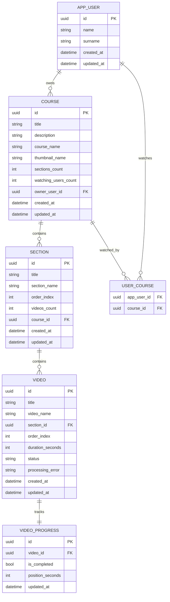

# Teachio Data Model ER Diagram (Crow's Foot)

```mermaid
erDiagram
    APP_USER {
        uuid id PK
        string name
        string surname
        datetime created_at
        datetime updated_at
    }

    COURSE {
        uuid id PK
        string title
        string description
        string course_name
        string thumbnail_name
        int sections_count
        int watching_users_count
        uuid owner_user_id FK
        datetime created_at
        datetime updated_at
    }

    SECTION {
        uuid id PK
        string title
        string section_name
        int order_index
        int videos_count
        uuid course_id FK
        datetime created_at
        datetime updated_at
    }

    VIDEO {
        uuid id PK
        string title
        string video_name
        uuid section_id FK
        int order_index
        int duration_seconds
        string status
        string processing_error
        datetime created_at
        datetime updated_at
    }

    VIDEO_PROGRESS {
        uuid id PK
        uuid video_id FK
        bool is_completed
        int position_seconds
        datetime updated_at
    }

    USER_COURSE {
        uuid app_user_id FK
        uuid course_id FK
    }

    APP_USER ||--o{ COURSE : owns
    COURSE ||--o{ SECTION : contains
    SECTION ||--o{ VIDEO : contains
    VIDEO ||--|| VIDEO_PROGRESS : tracks

    APP_USER ||--o{ USER_COURSE : watches
    COURSE ||--o{ USER_COURSE : watched_by
```
